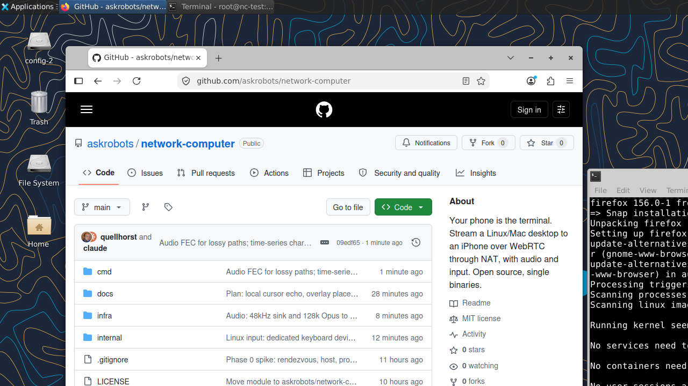

# network computer

Your phone is the terminal. The computer is somewhere else.

`network-computer` streams a Linux, macOS or (later) Windows desktop to an iPhone with
audio, and sends the phone's keyboard, mouse and touch back. Plug the phone into a TV or
AirPlay it to an Apple TV and it is a desk. Everything is open source, runs as single
static binaries, and works when both ends are behind NAT.

Status: **working on a test desk, not yet 1.0.** A cloud Linux desktop is used
from a Mac browser and an iPhone: sound both ways, responsive input, clipboard
and files. See [docs/PLAN.md](docs/PLAN.md) for the design,
[docs/DESKTOP.md](docs/DESKTOP.md) for what comes next on the desktop, and
[docs/SPIKE.md](docs/SPIKE.md) for measurements.



*A cloud Linux desktop streamed to a Mac browser through NAT, browsing this very repo. 1280×720, direct path, ~45 ms, with audio.*

## What works

- **Picture:** H.264 over WebRTC, direct through NAT when hole punching works and via
  the built-in TURN relay when it does not. The desktop resizes to your window (or a
  preset), with a UI scale from 100 to 200%.
- **Sound both ways:** the desktop's audio plays on your device, and your microphone (the
  browser's or the phone's) is a microphone on the desktop, for calls, recording and
  voice apps. Pick the mic in the page and watch its level.
- **Keyboard and mouse that feel local:** any layout (QWERTY, Dvorak, Colemak... are
  translated in the page, so the desk stays US), UK/German/French/Spanish, and on a Mac
  ⌘ acts as Ctrl on the desk, so ⌘C, ⌘V and ⌘Z do what your fingers expect. Touch on
  phones: tap to click, drag to move.
- **Clipboard both ways (text):** ⌘/Ctrl+V pastes your device's clipboard on the desk;
  copying on the desk comes back to your device. The 📋↑ and 📋↓ buttons move it without
  a keystroke, so the desk's right-click → Paste works too.
- **Files both ways:** drop files on the window and they land on the desk's Desktop. On
  the desk, right-click a file → **Send to my device** (or `nc-send FILE`) and a 📥 button
  appears in the page to save it.
- **Secure by default with a domain:** a real Let's Encrypt certificate, a password
  exchanged for a short-lived token, a host PIN typed once and then remembered through
  pairing, and relay credentials minted per session.
- **Hot desking:** the computer is disposable, your *desk* is not. A small volume keeps
  your settings, documents, keys and pairing; destroy the computer to stop paying, bring
  up another (any size) later, and sit down where you left off. See
  [docs/DESKS.md](docs/DESKS.md).
- **One-command desk on DigitalOcean:** `infra/droplet.sh up` builds a provisioned
  Ubuntu desktop (Xfce, Firefox, VLC, Audacity, the tools above) with its DNS name,
  checked by 51 automated checks; `infra/droplet.sh down` destroys it and keeps the desk.

### Clients

| Client | Where | Status |
|---|---|---|
| Browser | Built into `nc-rendezvous`: any modern browser, including Safari on iPhone and iPad | Everything above |
| [Flutter app](https://github.com/askrobots/network-computer-flutter) | iPhone, iPad, Android, macOS, Windows, Linux | Picture, sound, mic, touch and keyboard, pairing; clipboard, files and the screen menu not yet |
| `nc-probe` | Command line | Test client: path, frame rate, audio timing, clipboard and file transfer |

## How it works

```
 phone / browser                                     Linux / Mac / Windows host
 ┌──────────────────┐   WebRTC over UDP, direct       ┌──────────────────────┐
 │ video decode     │◄═══════════════════════════════►│ nc-host              │
 │ audio out        │   when hole punching works      │  ffmpeg capture      │
 │ keyboard, mouse  │                                 │  H.264 hw encode     │
 └────────┬─────────┘                                 │  input injection     │
          │                                           └──────────┬───────────┘
          │  signaling (WebSocket) + STUN + TURN relay fallback   │
          └───────────────┐                       ┌──────────────┘
                          ▼                       ▼
                    ┌──────────────────────────────────┐
                    │ nc-rendezvous  (one binary, one   │
                    │ VPS with a public IP, no database)│
                    └──────────────────────────────────┘
```

Three programs, all in Go:

| Binary | What it does |
|---|---|
| `nc-rendezvous` | Signaling over WebSocket, STUN and TURN on one UDP port, serves the browser client. Runs on any box with a public IP. |
| `nc-host` | Runs on the desktop you want to reach. Captures the screen and sound with ffmpeg, encodes H.264, streams over WebRTC, injects input, plays your microphone, and syncs clipboard and files. |
| `nc-probe` | Headless test client. Tells you whether a path is direct or relayed, what frame rate and audio timing arrive, and exercises the mic, screen size, clipboard and file transfer. |

## Requirements

- Go 1.27 or newer to build (go.mod pins it; an older Go downloads the toolchain automatically).
- `ffmpeg` on the host machine (`brew install ffmpeg`, `apt install ffmpeg`).
- On macOS, the terminal running `nc-host` needs Accessibility permission to inject
  input (System Settings, Privacy & Security, Accessibility). Use `-dry-run` to skip that.
- On Linux the host needs X11 (or XWayland) for capture, and write access to `/dev/uinput` for input (root, or a udev rule for the `input` group).

## Quick start (everything on one machine)

```sh
git clone https://github.com/askrobots/network-computer
cd network-computer
go build -o bin/ ./cmd/...

# 1. rendezvous. It prints a generated password; or set one.
NC_PASSWORD=change-me ./bin/nc-rendezvous -http :8765 -turn :3478

# 2. host, in another terminal. It prints a 6-digit PIN; or set one.
NC_PASSWORD=change-me ./bin/nc-host -rendezvous http://127.0.0.1:8765 -name mybox

# 3. open http://127.0.0.1:8765/ in a browser, log in with user "nc" and the password,
#    pick the host, type its PIN, connect. Click the video to grab mouse and keyboard;
#    shift+esc releases.

# or test headlessly:
NC_PASSWORD=change-me NC_PIN=<pin> ./bin/nc-probe -rendezvous http://127.0.0.1:8765
```

## Across the internet

**Recommended: give it a domain.** With a host name whose DNS is on DigitalOcean, one
command builds the server, points the name at it, and brings it up with a real Let's
Encrypt certificate:

```sh
NC_DOMAIN=nc.example.com infra/create-droplet.sh
# ... done. rendezvous: https://nc.example.com
```

Everyone then opens `https://nc.example.com`: no fingerprints, no certificate warnings,
and the microphone works in browsers, which only allow it on HTTPS pages. Rebuilds get a
new IP; the scripts move the DNS record with it. Why and how: [docs/DOMAIN.md](docs/DOMAIN.md).

`infra/` also scripts Vultr, Linode and AWS, or provisions any Ubuntu box you already
have with `infra/provision-host.sh <ip>`. See [infra/README.md](infra/README.md).

### Manual path

Open TCP 443 and 80 (or 8765 without TLS), UDP 3478, and UDP 49152 to 65535 for
relayed sessions.

```sh
# on the VPS, with a domain whose A record points here (certificate fetched automatically):
NC_PASSWORD=change-me ./bin/nc-rendezvous -turn :3478 -public-ip 203.0.113.5 \
  -acme-domain nc.example.com -local 127.0.0.1:8765

# no domain: plain HTTP (trusted LAN only; browsers will not allow the microphone)
NC_PASSWORD=change-me ./bin/nc-rendezvous -http :8765 -turn :3478 -public-ip 203.0.113.5

# no domain but over the internet: self-signed, and clients pin its fingerprint
NC_PASSWORD=change-me ./bin/nc-rendezvous -http :8765 -turn :3478 -public-ip 203.0.113.5 -mode secure
#   ...   sha256 6381268cf1b96418c9c3...
NC_TLS_FP=6381268c... NC_PASSWORD=change-me ./bin/nc-host -rendezvous https://203.0.113.5:8765 -name mybox

# on the desktop behind NAT
NC_PASSWORD=change-me ./bin/nc-host -rendezvous https://nc.example.com -name mybox

# from anywhere: does the path go direct or through the relay?
NC_PASSWORD=change-me NC_PIN=<pin> ./bin/nc-probe -rendezvous https://nc.example.com
NC_PASSWORD=change-me NC_PIN=<pin> ./bin/nc-probe -rendezvous https://nc.example.com -relay   # force TURN
```

## Authentication

Two layers, both simple on purpose:

1. **Rendezvous password, exchanged once for a token.** The page itself is public, so
   no browser login dialog ever appears. A client `POST`s its username and password to
   `/auth` once and gets a 12-hour token, then uses `Authorization: Bearer <token>` on
   `/config` and `/hosts`, and `?token=<token>` on the WebSocket (browsers cannot set
   WebSocket headers). Its own connect form is the only place credentials are typed.
   Headless clients (`nc-host`, `nc-probe`) may still use HTTP Basic instead. Set the
   password with `-password` or `NC_PASSWORD`; if unset a random one is generated and
   printed at startup. The username defaults to `nc` (`-user`, `NC_USER`).
2. **Host PIN, typed once.** Each host has a 6-digit PIN (`-pin` or `NC_PIN`, generated
   if unset). The first connection must present it; the host then returns a signed pairing
   token that the client keeps and sends instead, so the PIN is a one-time step. Two people
   sharing one rendezvous still cannot drive each other's machines. `nc-host
   -reset-pairings` revokes every paired client.

Media is encrypted by WebRTC (DTLS-SRTP) whether or not the rendezvous uses TLS. Over
plain HTTP the *signaling* (credentials, PIN, SDP) is in the clear, which is fine on a
trusted LAN and not for the open internet — run with `-acme-domain` or `-tls-cert` there.
`/config` reports `mode` as `secure` or `insecure` so clients can show which they are in.
`-mode auto|secure|insecure` forces the posture: `secure` refuses to run without TLS
(making a self-signed cert if you gave none), `insecure` refuses TLS flags. TURN relay
credentials are minted per `/config` request and expire after 12 hours, so a leaked one
goes stale on its own. See [docs/SECURITY.md](docs/SECURITY.md).

## Host options worth knowing

```
-size 1920x1080     output resolution (default; "native" disables scaling)
-fps 60             capture rate
-bitrate 8M         video bitrate cap
-encoder            h264_videotoolbox (mac), libx264 (default elsewhere), h264_vaapi, h264_nvenc, ...
-ffmpeg-extra       extra ffmpeg args, e.g. VA-API: -ffmpeg-extra "-vaapi_device /dev/dri/renderD128 -vf format=nv12,hwupload"
-ffmpeg-args        replace the whole ffmpeg command; must end with "-f h264 pipe:1"
-audio-device       stream audio from this device (mac: avfoundation index, needs a loopback such as BlackHole; linux: a pulse source)
-mic-device         play the client's microphone here (linux: a pulse sink such as nc-mic; mac: an output such as BlackHole)
-files-dir          save files dropped on the client here, e.g. ~/Desktop ('' = refuse them)
-send-socket        unix socket for nc-send ("Send to my device") ('' = off)
-state-dir          where the pairing secret lives (on a desk: the desk volume)
-display 1          capture a different screen
-dry-run            log input instead of injecting it
```

## Known limitations

- One ffmpeg per session; a second client on a macOS host will fail. Shared capture is next.
- No keyframe on demand; packet loss can show artifacts for up to 2 seconds.
- Linux hosts are the tested path. macOS hosts work (CGEvent input, pbcopy clipboard);
  Windows input (SendInput) is written but untested, and Windows hosts have no clipboard
  or file sync yet.
- Clipboard is text only. Folders must be zipped before sending.
- In Safari, text copied on the desk from a menu reaches your Mac at your next click or
  key press in the page (the browser only lets pages write the clipboard then).
- System audio on a macOS host needs a loopback device.

## Running it as an agent

A host is a real machine running `nc-host`, so an assistant with shell or input
access can operate it: run commands, install software, and drive the GUI while
reading the screen back. See [docs/AGENT.md](docs/AGENT.md).

## Layout

```
cmd/nc-rendezvous/   signaling, STUN/TURN, embedded web client
cmd/nc-host/         capture, encode, WebRTC, input, mic, clipboard, files, pairing
cmd/nc-probe/        headless test client
internal/proto/      signaling and input message types
internal/input/      per-OS input injection
internal/oggopus/    Opus packet reader for audio pacing
internal/tlspin/     certificate pinning for self-signed rendezvous
provision/           turns a fresh Ubuntu box into a desk (apply.sh, verify.sh)
infra/               create, rebuild and destroy desks on DigitalOcean and others
docs/                plan, desks, desktop, security, spike results
```

## License

MIT. See [LICENSE](LICENSE).
